# Enunciado #

## Requerimiento 1 - Base de datos ##

**Primero:** Tenemos que tener instalado Apache Tomcat. Para ello, abrimos nuestra terminal de Ubuntu. Tenemos que comprobar si tenemos instalado java, ya que sin ello no podremos acceder al servidor. Podemos comprobarlo con el siguiente comando:

	- java -version

Como vemos, no tenemos instalado java. Para instalarlo, utilizamos el comando que nos sugiere Ubuntu:

	- sudo apt install default-jre

Una vez lo hayamos instalado, podemos volver a ejecutar el primer comando *java -version* para comprobar que se ha instalado correctamente y además, ver qué versión de java tenemos. 

**Segundo:** Ahora que ya tenemos java instalado, vamos a proceder a instalar nuestro servidor Tomcat. Para ello, ejecutamos el siguiente comando:

	- sudo apt install tomcat9

**Nota:** Accedemos en nuestro navegador web y escribimos en la barra de dirección de búsqueda "localhost:8080". Nos aparecerá la página de tomcat que nos indicará que hemos instalado correctamente el servidor. La misma página nos indica también que al instalar tomcat9, necesitaremos tener instalada su documentación correspondiente tales como "docs", "examples" y "admin". Para poder instalar la documentación simplemente ejecutamos en nuestro terminal los siguientes comandos:

	- sudo apt install tomcat9-docs
	- sudo apt install tomcat9-examples
	- sudo apt install tomcat9-admin

Una vez hayamos descargado la documentación, comprobamos el estado del tomcat para saber que está ejecutándose y lo hacemos mediante el comando 

	- systemctl status tomcat9
	- sudo ufw allow 8080/tcp (para que escuche por el puerto 80)

**Tercero:** Ahora que ya tenemos tomcat instalado, hemos descargado su documentación y hemos comprobado que se está ejecutando, vamos a acceder a dichos documentos para modificarlos y poder acceder al servidor desde nuestro localhost.  

El primer documento al que vamos a acceder, es el documento de los usuarios. Ejecutamos el comando 

	- sudo nano /etc/tomcat9/tomcat-users.xml

Nos aparecerá el siguiente documento:

Nos fijamos que en el documento aparece comentado los usuarios de tomcat. Esta parte del documento habrá que modificarla.

Lo que hacemos es descomentar los usuarios que vienen por defecto y en ellos, modificamos los roles y los usuarios según nuestra necesidad. Para nosotros, nos interesa que haya 2 roles por ahora. 

El primer rol, será el de “manager-gui” y el segundo rol, el de “admin-gui” y como usuarios, vamos a dejar uno que será “admin” con password “admin” y role “manager-gui,admin-gui”. Insistiendo en que este usuario será el primero e iremos modificando más adelante si es preciso. 

Ahora que ya tenemos nuestros usuarios modificados, vamos a parar y arrancar de nuevo el servidor tomcat. Para ello, ejecutamos los siguientes comandos:

	- service tomcat9 stop (nos pedirá contraseña de nuestra máquina)
	- service tomcat9 start (nos volverá a solicitar la contraseña)

Una vez reiniciado el servidor, vamo a acceder a los siguientes documentos. Estos documentos serán por un lado, el *manager* y por otro, el *host-manager* con los siguientes comandos:

	- sudo nano /etc/share/tomcat9-admin/manager/META-INF/context.xml
	- sudo nano /etc/share/tomcat9-admin/host-manager/META-INF/context.xml

Ambos documentos deberán aparecer así:

Cuando hayamos comprobado que ambos documentos aparecen iguales, salimos del *context.xml* y reiniciamos el tomcat con el comando

	- sudo systemctl restart tomcat9

Y una vez hayamos reiniciado el servidor, nos dirigimos nuevamente a nuestro navegador y escribimos en la dirección de búsqueda “localhost:8080/manager/html” y nos deberá aparecer la página principal del manager de tomcat.

**Cuarto:** Ya tenemos todo a punto para manejar tomcat. Ahora, lo que vamos a hacer es desplegar el archivo war que facilita el profesor en su proyecto git. Lo descargamos en nuestra máquina virtual y en el apartado de tomcat donde dice "desplegar archivo war" lo subimos. 

Una vez hemos cargado el archivo, en el apartado "Aplicaciones" de nuestro tomcat, aparecerá. Pulsamos en el y nos lleva a la página de bienvenida. Si intentamos acceder a la Base de Datos, nos aparecerá en blanco porque aún no la hemos cargado. 

**Quinto:** Llegados a éste punto, el siguiente paso será instalar nuestra base de datos. Para ello, abrimos nuestra terminal de Ubuntu. Antes de nada, **se recomienda** actualizar nuestra terminal por si hubiese algún fichero o algo sin actualizar, pero esto simplemente como consejo. Si se quiere actualizar nuestra terminal, se usará el comando *"sudo apt-get update"*  y si aparecen ficheros listos para actualizar, ejecutaremos el comando *"sudo apt-get upgrade"*. En nuestro caso, decidimos que sí lo hacemos y la actualizamos. 

Dicho esto, ahora sí, vamos a instalar nuestra BBDD. El equipo hemos deliberado qué opción puede ser mejor para trabajar. Hemos decidido escoger la BBDD de MySQL ya que nos permite trabajar desde nuestra terminal, directamente por comandos y ahorrarnos el descargar por interfaz de usuario otras, como puedan ser WorkBrench, Oracle, etc.

Para la instalación de MySQL, ejecutamos el siguiente comando:

	- sudo apt install mysql-server

Una vez hemos instalado MySQL, ahora vamos a dar una contraseña. Ejecutamos el comando:

	- sudo mysql _secure_installation

Con este último comando, podemos acceder con nuestra contraseña del S.O. o cambiarla por otra que consideres oportuna. 

El comando anterior nos irá preguntando modalidades como ¿desea utilizar su contraseña habitual?¿quiere eliminar el usuario anónimo? etc.

Una vez hemos configurado las opciones que se muestran en la imagen anterior, ahora iniciamos MySQL con el comando

	- sudo mysql -u root -p

Cuando estamos dentro de mysql, lo siguiente que vamos a hacer es crear la tabla con los datos que se adjuntan en el enunciado. 

Para crear la tabla usamos el comando 

	- CREATE DATABAS nombreBaseDatos;
	- show databases; (Para comprobar que la hemos creado correctamente)

Cuando ya hemos creado la BBDD, el siguiente paso es crear la tabla. Vamos a seguir el patrón del enunciado y creamos la tabla personas con los datos del DNI como primaryKey, el nombre y apellidos. **Se ejecuta todo el comando en la misma línea** el patrón que tenemos que seguir es **CREATE TABLE nombreTabla (campo tipoDato(caracteres) primaryKey)** y todos los datos que queramos añadir separados entre comas.

 

**Sexto:** Ahora tenemos que cambiar el recurso que se indica en el ejercicio para ello tenemos que acceder al **context** de tomcat. Utilizamos el comando:

	- sudo nano /var/lib/tomcat9/conf/contex.xml

Una vez hemos accedido, procedemos a modificar el contenido como se indica en los apuntes

Guardamos el archivo pulsando ^x  y volvemos a restablecer el tomcat con el comando “systemctl tomcat9 restart”. Una vez lo hayamos reseteado, volvemos a acceder a la BBDD

**Séptimo** Nos encontramos con el problema de que no podemos acceder. Para solucionar este inconveniente, tenemos que descargarnos el conector de mysql. Para ello, nos dirigimos a: **https://mvnrepository.com/artifact/mysql/mysql-connector-java** y descargamos el que sea acorde a nuestro mysql. 

Una vez lo hayamos descargado, tenemos que llevar el archivo a la librería del tomcat. Cuando lo hayamos pegado en dicha carpeta, procedemos a extraerlo en la misma. 

**Nota:** Si vemos que no conecta la BBDD, tenemos que volver a resetear el servidor y comprobar que tenemos los puertos abiertos en el firewall 

**Octavo:** Volvemos a acceder a la BBDD y vemos como ya sí que se visualiza correctamente

Por último, podemos insertar datos bien utilizando el entorno gráfico que nos aparece en el localhost o bien por comandos. El uso del comando se procesa de la siguiente estructura:

	- Insert into Table (atributo) values (valor);

**Ejemplo:**

**Nota:** Podemos hacerlo mediante entorno gráfico también a través de workbench (o cualquier otra base de datos) primero tenemos que asegurarnos que establece la conexión perfectamente usando nuestro usuario y contraseña:

**Noveno:** Insertamos los campos como se indica en el enunciado

Finalmente, volvemos a cargar la página de la BBDD y comprobamos que se han insertado correctamente los campos:

## Requerimiento 2 - Apache CDN ##

CDN es una forma habitual de separar el contenido estático de una aplicación web Consiste en ubicarlo en un servidor virtual que se puede replicar para que cada usuario descargue ese contenido del servidor más cercano a su ubicación La aplicación espera que exista un recurso "jndi/CDN" que apunte a la dirección web donde se han subido los ficheros estáticos se deberá crear ese servidor virtual y el recurso correspondiente en el Servidor de Aplicaciones.

Para realizar la actividad tenemos que tener instalado apache, para eso tendremos que poner en el la consola “sudo apt install apache2”

Luego nos metemos en el github de la actividad para descargarnos tanto el war. Como el zip con el contenido CDN.

Para conectar el tomcat con el apache iremos a la carpeta “var/lib/tomcat9” y nos metemos en el context.xml , añadiendo al mismo el Environment con un name, value y type cambiados

Para alojar el zip descargados nos vamos a la carpeta “var/ww/html”

Y pegamos el contenido:

Después de hacer estos pasos probamos que todo este funcionando,

Y vemos el resultado:

## Requerimiento 3 - FTP ##

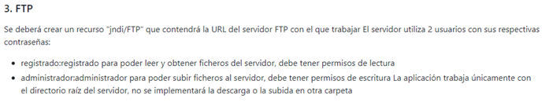

Para la configuración del servidor FTP vamos a utilizar vsftpd. En primer lugar, lo instalamos mediante “apt install”: 

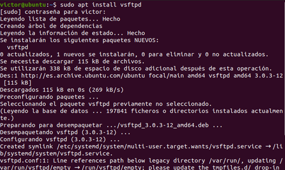

Una vez instalado, aseguramos que tenemos abierto el puerto 21, por el que se ejecutará nuestro servidor:

Configuramos el servidor FTP para que cumpla con lo solicitado en la práctica. Accedemos al fichero vsftpd.conf mediante el comando nano:

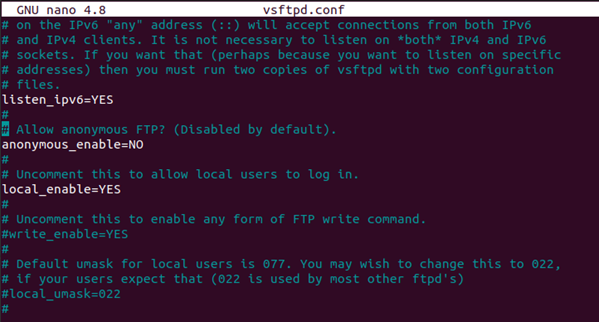

Por un lado, “descomentaremos” las opciones vistas en clase para que los usuarios solo puedan compartir vía FTP su directorio /home/:

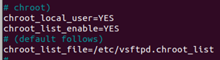

Cabe destacar que para permitir que el usuario “administrador” pueda tener permiso de escritura, se debió de incorporar la instrucción “allow_writeable_chroot=YES”, en caso contrario el servidor no dejaba logarse con dicho usuario: 

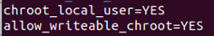

Crearemos el usuario “registrado”, que incluiremos en la lista antes mencionada: 

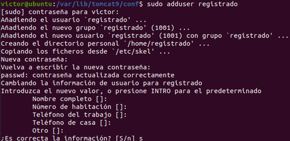

Creamos el fichero:

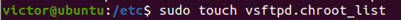

Introducimos al usuario “registrado”:

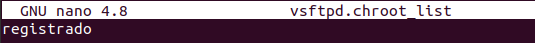

Generamos el usuario “administrador” del mismo modo, así como lo incorporamos a la lista anterior, y añadimos el siguiente comando para que su carpeta home corresponda con la que se compartirá vía FTP: 

Posteriormente se crea un grupo “FTP”, donde introduciremos ambos usuarios; de este modo el usuario “registrado” tendrá acceso de lectura y ejecución, pero no de escritura. Asimismo, nos aseguramos que la carpeta a compartir tiene asignado el grupo creado:

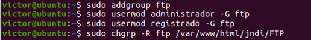

Generamos la variable en el fichero context.xml. Es interesante observar que, si se introducía el puerto o el usuario, la aplicación no funciona correctamente: 

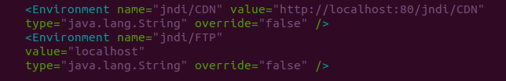

Tras esto, el servidor FTP ya habría quedado configurado para su uso con la aplicación facilitada, como último paso, introducimos los recursos requeridos dentro del directorio. 
NOTA IMPORTANTE: observando el código del .war adjunto, hemos determinado que este predefinía que el usuario debe es siempre “registrado”, motivo por el cual no permite adjuntar archivos desde la aplicación (ya que ese usuario ha sido configurado conforme no dispone de permisos de escritura): 

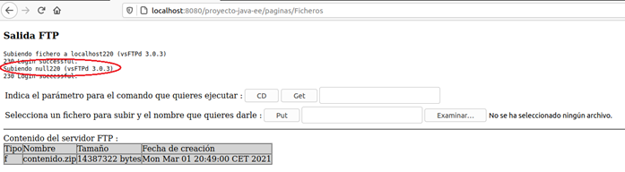

Finalmente, hemos logrado que los ficheros de configuración de la propia aplicación web se encuentren disponibles en la carpeta habilitada en el servidor FTP (faltando únicamente este manual que será incorporado a su finalización:

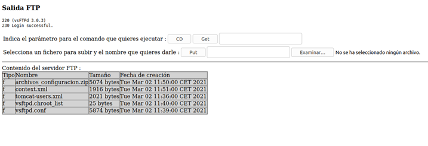

Si solicitamos un fichero, este aparece en el navegador (en este caso, el listado de usuarios que han sido limitados a su carpeta home):

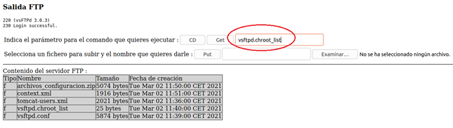

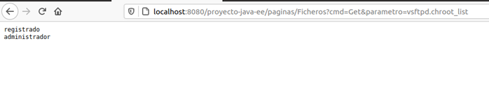

